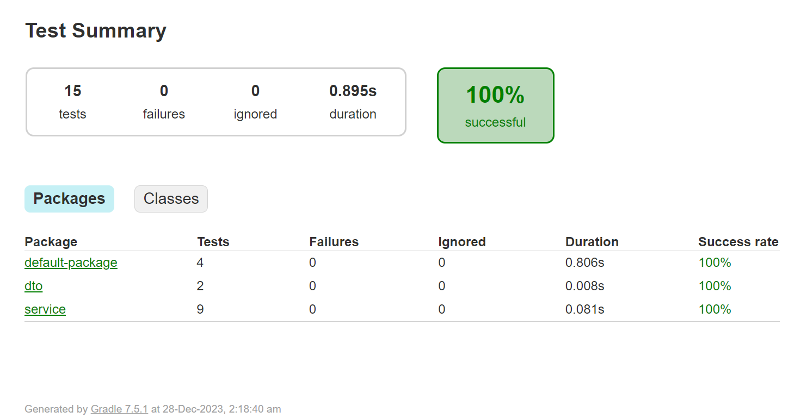

# Social Media Event Aggregator

This command-line utility is designed for a backend service in a social media app. Its primary purpose is to aggregate user activity events, producing daily summary reports. These reports encompass various metrics such as the number of posts, likes received, and more, organized on a per-day basis. Notably, the utility has the capability to update these summary reports in real-time as new events are introduced into the dataset.

## Project Structure

* UserEvent.kt: Data class representing a user event.
* DailySummary.kt: Data class representing daily summary information.
* EventAggregator.kt: Service class for aggregating events and generating reports.
* Main.kt: Main entry point for running the application.

### UserEvent

The `UserEvent` data class represents a user event with the following properties:

- **userId**: The unique identifier of the user who performed the event.
- **eventType**: The type of event (e.g., post, likeReceived, comment).
- **timestamp**: The timestamp when the event occurred, represented in milliseconds.

### DailySummary

The `DailySummary` data class encapsulates information about daily event summaries:

- **userId**: The unique identifier of the user for whom the summary is generated.
- **date**: The date for which the summary is created in the format "yyyy-MM-dd".
- **post**: The count of post events for the day (default is 0).
- **likeReceived**: The count of likeReceived events for the day (default is 0).
- **comment**: The count of comment events for the day (default is 0).

**Note**: The `@JsonInclude(JsonInclude.Include.NON_DEFAULT)` annotation is used to exclude default (0) values from the generated JSON.

### EventAggregator

The `EventAggregator` class provides functionality to aggregate user events and generate daily summaries:

- **readExistingOutput(outputFileName: String): List<DailySummary>**: Reads existing summary data from a JSON file.
- **readInputFile(inputFileName: String): List<UserEvent>**: Reads user events from a JSON file.
- **writeOutputFile(outputFileName: String, outputData: List<DailySummary>)**: Writes summary data to a JSON file
- **aggregateEvents(inputFileName: String, outputFileName: String, update: Boolean)**: Aggregates user events, updates existing summaries, and writes the results to a JSON file.

### Main

The `Main` class serves as the entry point for running the application. It reads command-line arguments and calls the `aggregateEvents` function.

### Usage

Run the application with the following command:

First Build the project with the below command
```bash
.\gradlew build
```

To run the code use the below command
```bash
.\gradlew run -Pargs="-i input.json -o output.json"
```

To run the code use the below command with update
```bash
.\gradlew run -Pargs="-i input.json -o output.json --update"
```

* -i: Input JSON file containing user events.
* -o: Output JSON file for daily summary reports.
* --update: Update existing summary with new events (optional).

## Test Cases:

### 1. Main Function Usage Message:
- **Scenario:** Insufficient or incorrect command line arguments are provided.
- **Test Case:** Ensure that the main function prints the correct usage message.
- **Functions:** `main should print usage when insufficient arguments provided`, `main should print usage when incorrect argument format provided`

### 2. Read Existing Output File:
- **Scenario:** Attempt to read an existing output file.
- **Test Case:** Ensure the `readExistingOutput` function returns the expected list of `DailySummary` objects.
- **Functions:** `readExistingOutput should return empty list for non-existing file`, `readExistingOutput should return empty list for empty file`, `readExistingOutput should correctly read existing summary from file`

### 3. Read Input File:
- **Scenario:** Attempt to read an input file containing user events.
- **Test Case:** Ensure the `readInputFile` function returns the expected list of `UserEvent` objects.
- **Functions:** `readInputFile should return empty list for non-existing file`, `readInputFile should return empty list for malformed JSON file`, `readInputFile should correctly read user events from existing file`

### 4. Write Output File:
- **Scenario:** Attempt to write the aggregated data to an output file.
- **Test Case:** Ensure the `writeOutputFile` function writes the data without errors.
- **Functions:** `writeOutputFile should write data to the specified file`

### 5. Aggregate Events:
- **Scenario:** Aggregate user events and generate reports.
- **Test Case:** Ensure the `aggregateEvents` function correctly processes events and updates existing output.
- **Functions:** `aggregateEvents should correctly aggregate events`, `aggregateEvents with update should correctly update existing summary`

### 5. Data Classes:
- **Scenario:** Creating data model.
- **Test Case:** Ensure the `UserEvent` and `DailySummary` data class correctly processes data.
- **Functions:** `UserEvent should have correct properties`, `DailySummary should have correct properties`

### 6. Write Test Cases for Main Function:
- **Scenario:** Execute the main function with various command line argument scenarios.
- **Test Case:** Ensure the main function behaves correctly in response to different command line inputs.
- **Functions:** `main should call aggregateEvents when correct arguments provided`, `main should call aggregateEvents with update when correct arguments provided`

## Test Report:

